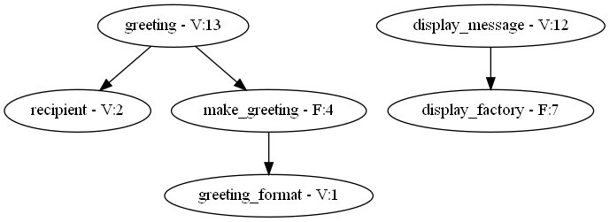

Pyfactor
========
Script dependency visualisation of imports, variables, classes and functions.

*Pyfactor* exists to make refactoring long scripts easier.
This is achieved by graphing definitions and their dependencies.
Such a graph could reveal collections of definitions or connection hubs
that could be better off extracted to sub-modules,
or design flaws in the form of too many interconnections.
See `examples`_ for more.

Installation
------------
A PyPI package is not yet available.
In the meantime this repository can be cloned and installed via GitHub.
For automatic updates when pulling, install an *editable* package as below.

.. code:: sh

   $ git clone https://github.com/felix-hilden/pyfactor
   $ cd pyfactor
   $ pip install -e .

**Additionally**, `Graphviz <https://graphviz.org/>`_ (free graph visualisation
software) must be installed, which is used for generating the visualisations.
It is available for Linux, Windows and Mac.

Usage
-----
*Pyfactor* is a command line tool.
The most basic usage involves passing in a script,
from which a graph file and a PDF visualisation is generated.
See the help for details.

.. code:: sh

   $ pyfactor --help
   $ pyfactor script.py

:code:`pyfactor.parse` and :code:`pyfactor.render`
are exposed with similar arguments for importing and usage in code.

Examples
--------
Let's look at two (overly complicated) example Hello World scripts
and the visualisations they produce.

.. code:: python

    greeting_format = 'Hello {}!'
    recipient = 'World'

    def make_greeting(target):
        return greeting_format.format(target)

    def display_factory(display_func):
        def displayer(message):
            display_func(message)
        return displayer

    display_message = display_factory(print)
    greeting = make_greeting(recipient)
    display_message(greeting)

.. code:: python

    greeting_format = 'Hello {}!'
    recipient = 'World'

    def attach_message(message, display):
        if recipient.lower() == 'world':
            return lambda to: (message.format(to), display)
        else:
            return lambda to: ('Message not available!', display)

    def call_displayer_factory(message, display_func):
        return lambda: display_func(message)

    make_message_display = attach_message(greeting_format, print)
    display_greeting = call_displayer_factory(*make_message_display(recipient))
    display_greeting()

.. image:: docs/src/example_dirty.png
   :width: 400
   :alt: messy example

The first script is far superior with clear separation between
generating the greeting and displaying it,
while the latter script has no such structure.

Documentation
-------------
Online documentation on Read The Docs is on the way.
Local documentation can be built with Sphinx.
Optional development dependencies must be installed before building.

.. code:: sh

   $ pip install -e .[dev]
   $ cd docs
   $ make html
